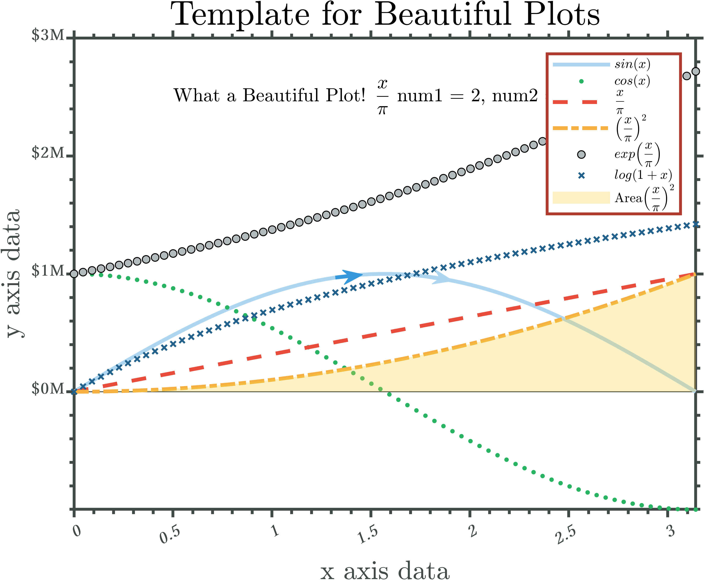

# MATLAB_Defaults

## Instructions
A MATLAB repository for setting defaults especially for improving plots

Start by reading GENERAL_INSTRUCTIONS.txt

## Citation
https://doi.org/10.5281/zenodo.7439954

## Example Plot:

